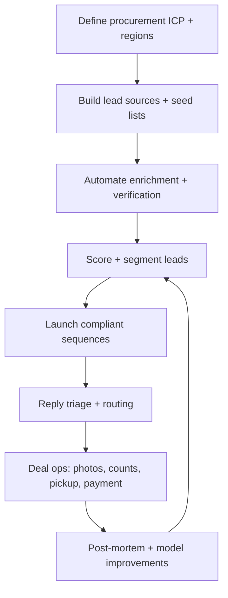

# AI-Driven Outreach Automation for Sourcing Liquidated Banquet Chairs

## Executive summary

Your goal—buying used banquet chairs from large venues (convention centers, hotels, and large churches) and reselling to entity["city","Lawrence","Kansas, US"]-area churches and nonprofits—fits a “signal-driven sourcing” model: continuously find high-capacity venues, detect liquidation triggers (renovations, closures, surplus events), identify the right contacts (facilities/event ops/procurement), and run compliant, persistent follow-up until you get a yes/no/redirect. The best-performing automation stacks in this motion generally separate (a) lead sourcing/enrichment, (b) verification/scoring, (c) outreach sequencing, and (d) CRM logging—because data quality and deliverability are the two main failure points. citeturn22search4turn7search0turn8search1turn8search2

A practical, high-leverage “small business but scalable” stack is:

- **Lead + enrichment spreadsheet layer**: entity["company","Clay","gtm enrichment platform"] (especially its AI research/enrichment approach) citeturn11search0turn22search6  
- **Contact database + sequencing option**: entity["company","Apollo.io","sales intelligence platform"] (useful if you want one tool to both find contacts and run sequences, or as a data source feeding your sequencer) citeturn10search0turn22search1  
- **Email sequencer optimized for scale**: entity["company","Instantly.ai","cold email platform"] or entity["company","Smartlead.ai","cold email platform"] (rotation/warmup concepts are central to their positioning and user use-cases) citeturn10search1turn11search3turn20search8  
- **Workflow orchestration + AI “glue”**: entity["company","Zapier","automation platform"] (including its Agents product direction) or entity["company","Make","automation platform"] citeturn18search5turn24search3turn6search2  
- **Optional: scraping/POI extraction**: entity["company","Apify","web scraping platform"] for structured extraction from venue directories/search results where permitted citeturn19search1turn19search11  

Outsourcing is realistic if you hire specialists from official partner directories (rather than generic freelancers) and insist on proof: working automations, deliverability setup, and measurable outbound outcomes. citeturn15view0turn5search11turn6search5turn6search2turn18search0

## Sources and methods to locate target venues

### Venue discovery data sources that map well to your niche

The most reliable “venue universe” sources for your targets are venue directories, POI datasets/APIs, and (for publicly owned facilities) surplus channels.

Large event venues and meeting hotels frequently appear in dedicated venue directories like entity["organization","Cvent Supplier Network","venue directory"] and general venue directories like entity["organization","Eventective","venue directory"], which are useful as starting points for building a lead list, then hopping to each venue’s official site to confirm capacity and extract “events/facilities/procurement” contacts. citeturn3search23turn3search24

For large churches, the entity["organization","Hartford Institute for Religion Research","megachurch research center"] maintains a searchable **Megachurch Database** (U.S. megachurches they have located), which is one of the most direct ways to seed a list of unusually large congregations likely to have event/banquet seating inventory or facility staff. citeturn23search1turn23search0

Public-sector and institutional channels can be disproportionately valuable because they *broadcast* furniture movement via surplus programs (reducing the need for cold outreach). Examples include government auction guidance (federal overview) and state/city/university surplus programs. citeturn21search10turn21search17turn21search1turn21search21

### Fast lead-capture methods for “venues near me” style targeting

A scalable approach is to define a geographic radius around your resale market (e.g., 50–250 miles around Lawrence depending on transport economics) and run repeatable “venue type” searches using POI sources:

- **OpenStreetMap + Overpass** queries can locate candidate objects by tags like `amenity=conference_centre` or `tourism=hotel` (then you enrich externally). citeturn4search0turn4search4  
- **Places APIs** (e.g., entity["company","Google","technology company"] Places) can return structured business listings and websites for hotels and event venues (subject to pricing/terms). citeturn4search1  

In practice, you use these sources to get: venue name, address, website, phone, and category. Then your enrichment layer finds role-based emails and validates them.

### Lead prioritization criteria tailored to furniture liquidation likelihood

A useful scoring model should prioritize venues where chair replacement is *plausible* and where the organization can execute a bulk transaction.

Core priority signals (most can be automated):

- **Seating scale proxy**: published banquet capacity / meeting room capacity / ballroom specs on official venue pages and venue directory listings. (You’ll typically need to extract this from venue sites; the directories help you discover them.) citeturn3search23turn3search24  
- **Ownership and disposal channel**: publicly owned convention centers, universities, and municipalities are more likely to route furniture via formal surplus processes (meaning you can win lots via auctions rather than persuasion). citeturn21search10turn21search17turn21search21  
- **Renovation/refresh cues**: venues that are renovating, rebranding, or refurbishing often need to clear FF&E (furniture/fixtures/equipment), which is where banquet chairs can surface. citeturn21search3turn21search15turn21search7  
- **Centralized decision roles exist**: venues with visible facilities/procurement/event-ops contacts, or at least staff directories, are easier to work. (This is where enrichment and web research agents matter.) citeturn11search0turn22search6

Supplemental “parallel sourcing” channels (worth automating alongside outreach):

- entity["company","GovDeals","online auction marketplace"] includes chair and banquet chair lots; you can set saved searches and alerts. citeturn21search0turn21search4  
- entity["organization","Public Surplus","online surplus auction platform"] lists furniture and chair lots from public entities. citeturn21search2  
- entity["organization","USA.gov","US government portal"] provides a consolidated overview of finding government auctions (furniture included). citeturn21search10  

These don’t replace venue outreach—but they often produce the fastest “inventory wins” while your outbound pipeline ramps.

## Data collection and enrichment tools for verified contacts

### Enrichment and research layer

entity["company","Clay","gtm enrichment platform"] is positioned as a GTM enrichment/workflow spreadsheet with an embedded AI research agent (“Claygent”) and sequencing capabilities on its pricing/features pages; entity["company","OpenAI","ai company"] has also published a Clay customer story describing Claygent as an AI web scraper approach using GPT‑4. citeturn11search0turn22search6

For your use case, the highest-value automations in this layer are:

- **Role discovery**: identify likely targets (Director of Facilities, Event Operations Manager, Purchasing, Asset Manager, Church Administrator).  
- **Contact pattern inference**: find likely email formats from domains and staff lists.  
- **Website extraction**: pull signals like “renovation,” “capital campaign,” “building expansion,” “new campus,” “recent remodel,” “surplus,” “auction,” etc. (These become prioritization features.) citeturn22search6turn21search15  

### Contact databases, verification, and accuracy controls

entity["company","Apollo.io","sales intelligence platform"] offers a combined system of contact data plus outbound sequencing and integrations (per its site and pricing pages), and its customer stories emphasize measurable GTM outcomes (though vendor case studies should be treated as directional, not independent). citeturn10search0turn22search1

Because cold outreach lives or dies on deliverability and data hygiene, many teams add an email verification step. For example, entity["company","ZeroBounce","email validation service"] publishes a “guarantee” and documentation around validation accuracy claims, and entity["company","NeverBounce","email verification service"] provides developer documentation for single-email checking via API. citeturn13search1turn14search27  

Practical best practice: treat every email address as “untrusted” until verified (or until it survives real sending with low bounces), and route catch-all/unknown outcomes into a lower-volume lane to protect sender reputation. citeturn13search15turn8search1turn8search2

### Scraping and POI extraction tooling

For structured extraction, entity["company","Apify","web scraping platform"] provides a marketplace and programmatic API for “Actors,” with published pricing and examples like Google Maps scraping products (use only where terms and law allow, and prefer official APIs when possible). citeturn19search1turn19search11turn19search4

Other no-code automation/scraping tools commonly used in outbound include entity["company","PhantomBuster","automation platform"] and entity["company","TexAu","automation platform"], both with public pricing pages. citeturn19search2turn19search3

A critical constraint: **LinkedIn explicitly prohibits third-party software/extensions that scrape or automate activity on LinkedIn**, and it warns that automated activity can lead to restrictions. This is a material risk if your outreach plan includes LinkedIn automation. citeturn9search1turn9search13

## Outreach automation platforms and outsource options with evidence

### Core outreach platforms that fit “buy used inventory” outreach

The best-fit sequencers for your specific motion have: multi-inbox sending, throttling/ramp-up, reply classification, CRM logging, and simple personalization at scale.

- entity["company","Instantly.ai","cold email platform"] publishes a pricing page including customer testimonial-style quantified claims (e.g., volumes/domains/reply rates) and also publishes a 2026 cold email benchmark report with aggregate reply rate statistics and follow-up contribution. citeturn10search1turn22search4  
- entity["company","lemlist","cold outreach platform"] publishes success stories with quantified outbound outcomes (example: an ElevenLabs story citing interaction and reply rates). citeturn22search3turn22search7  
- entity["company","Reply.io","sales engagement platform"] publishes a pricing page with multichannel positioning (email/LinkedIn/calls/SMS), but “LinkedIn automation” must be weighed against LinkedIn’s prohibition of third-party automation. citeturn12search0turn9search1  
- entity["company","Smartlead.ai","cold email platform"] publishes pricing with contact and send limits by tier, suitable for lightweight “sending engine” roles in a modular stack. citeturn11search3  

On the “all-in-one GTM” side, entity["company","Apollo.io","sales intelligence platform"] positions itself as prospecting + engagement + automation and publishes customer stories citing measurable outcomes such as pipeline growth or meeting increases (again: treat vendor case studies as supportive evidence, not independent validation). citeturn22search1turn22search9  

### AI sales agents as an alternative to classic sequencers

If you want more autonomy in research + personalization + follow-up handling, AI “BDR agent” vendors (built for sales pipeline creation) can be repurposed for procurement-style outreach—but you should test cautiously because misaligned automation can annoy targets.

- entity["company","Artisan","ai bdr platform"] publishes case studies including a SaaStr example with quantified outcomes (positive reply rate) and a broader case study listing page. citeturn24search2turn24search6  
- entity["company","Regie.ai","ai sales engagement platform"] publishes a case study claiming large pipeline improvements and opportunity creation metrics. citeturn24search0  

These can reduce manual effort, but your risk controls must be stronger: strict sending limits, tight ICP definitions, and human review on early runs.

### Outsourcing: where to find credible automation and outreach operators

The most defensible hiring approach is to start with **official partner directories** and require proof relevant to outbound + deliverability + data workflows.

Official partner directories and marketplaces:

- entity["company","Clay","gtm enrichment platform"] Solution Partners directory (filters include pricing and minimum engagement). citeturn15view0  
- entity["company","Apollo.io","sales intelligence platform"] Certified Partners directory. citeturn5search11  
- entity["company","Zapier","automation platform"] Solution Partner Directory (consultants/agencies). citeturn6search5turn18search2  
- entity["company","Make","automation platform"] Partner Directory. citeturn6search2  
- entity["company","n8n","workflow automation platform"] Experts Partner Program. citeturn18search0  
- General freelance marketplace option example: entity["company","Upwork","freelance marketplace"] listings for Zapier developers (useful but requires heavier vetting). citeturn18search12  

Evidence you can cite directly from partner listings (useful for screening):

- entity["organization","The Kiln","gtm engineering agency"] listing shows a pricing band (“$10k+ a month”) and minimum engagement (3 months) on Clay’s directory page. citeturn17view1  
- entity["organization","Beanstalk Consulting","outbound as a service agency"] listing shows a pricing band (“$5k+ a month”) plus a testimonial snippet embedded on Clay’s directory page. citeturn17view3  

This matters because it lets you quickly segment vendors into: (a) high-touch agencies, (b) solo implementers, (c) pure automation builders, and (d) managed outbound operators.

### YouTube setup tutorials and outcome walkthroughs

Direct access to YouTube watch pages was not consistently available in this browsing environment, so I could not reliably extract chapter timestamps from the video descriptions themselves. The citations below still point to the exact videos for setup demonstrations, and the “timestamp extraction” method in the implementation section explains how an agent can produce timestamped learning notes in minutes using a transcript tool.

High-signal examples surfaced in research include:

- Artisan demo video (overview of AI SDR concept). citeturn6search19  
- Clay + OpenAI API case study finder walkthrough (tactical enrichment/research video). citeturn22search18  
- NeverBounce validation walkthrough (example implementation tutorial). citeturn14search34  

## Recommended automation workflows and outreach templates

### Workflow architecture

A procurement-style outreach system works best as a loop: build list → verify → score → outreach → classify replies → enrich/route follow-ups → log outcomes → learn and refine.

```mermaid
flowchart LR
  A[Lead sources: venue directories, POI APIs, megachurch database, surplus auctions] --> B[Normalize + dedupe: name, domain, location]
  B --> C[Enrich: roles, emails, phones, venue capacity signals, renovation cues]
  C --> D[Verify emails + risk score]
  D --> E[Lead scoring + routing: High intent / Medium / Watchlist]
  E --> F[Sequenced outreach: email first, optional call tasks]
  F --> G[Reply handling: classify -> interested / not now / wrong person]
  G --> H[Human-in-the-loop negotiation: pricing, pickup dates, quantity, photos]
  H --> I[CRM logging + inventory tracker]
  I --> C[Feedback loop: learn which signals correlate with chair availability]
```



This mirrors how sales outreach platforms describe modern “prospecting → enrichment → engagement → logging” loops, adapted to your sourcing goal. citeturn22search17turn24search3turn11search0

### Recommended workflows by complexity tier

**Tier A: Minimal viable system (fastest to launch)**  
Use a single platform for contacts + outreach (often entity["company","Apollo.io","sales intelligence platform"]) plus a spreadsheet inventory tracker. This reduces integration work but can leave you with weaker signal scoring and less control over enrichment waterfalls. citeturn10search0turn22search5

**Tier B: Modular “GTM engineering” system (best balance for your use case)**  
Use entity["company","Clay","gtm enrichment platform"] for multi-source enrichment and scoring, push qualified contacts into a dedicated email sequencer like entity["company","Instantly.ai","cold email platform"] or entity["company","Smartlead.ai","cold email platform"], and orchestrate everything through entity["company","Zapier","automation platform"] or entity["company","Make","automation platform"]. citeturn11search0turn10search1turn11search3turn24search3turn6search2

**Tier C: AI agent-led system (higher autonomy, higher risk if misconfigured)**  
Use an AI BDR agent like entity["company","Artisan","ai bdr platform"] or entity["company","Regie.ai","ai sales engagement platform"] for research + personalization + follow-ups, with strict governance and sending caps. citeturn24search2turn24search0

### Outreach message templates for banquet chair sourcing

Below are starting templates designed to feel like procurement help, not spam. They assume you can pick up locally and make it easy for the recipient to forward you to the right person.

**Initial email: facilities / event ops**

```text
Subject: Quick question — any surplus banquet chairs available now or soon?

Hi {{FirstName}},

I’m reaching out because we buy surplus banquet chairs in bulk from venues like {{VenueName}}.

If you ever rotate out chairs (renovation, refresh, surplus, storage clean-out), we can:
- buy lots of 100–1,000+
- arrange pickup (we can work around your event schedule)
- pay quickly and remove them fast

Is there a facilities/procurement contact I should speak with about any chair surplus (now or planned)?

Thanks,
{{YourName}}
{{YourCity}}, KS
{{Phone}}
```

**Follow-up: “bump + make forwarding easy”**

```text
Subject: Re: surplus banquet chairs

Hi {{FirstName}} — just bumping this.

If chairs aren’t your area, could you point me to the right person (facilities, purchasing, event ops)?

Two quick questions to route this correctly:
1) Do you own your banquet chairs or does a vendor manage them?
2) Do you have any storage/surplus process for furniture?

Thanks again,
{{YourName}}
```

**Follow-up: “low-friction inventory check”**

```text
Subject: 30-second check

Hi {{FirstName}},

Totally understand if timing isn’t right. For future reference, do you ever surplus banquet chairs?

If yes: what’s the best month/season to check back?

Appreciate it,
{{YourName}}
```

The goal is to convert “no response” into “right person” or “check back in Q3,” which is still a win for a sourcing pipeline (and aligns with benchmark evidence that follow-ups contribute materially to total replies). citeturn22search4

### Reply triage rules that should be automated

Automate these classifications and task prompts:

- **Interested / has chairs** → create a “Deal” record + request photos and counts + schedule call/pickup.  
- **Not now / later** → write back with a lightweight calendar reminder (60–120 days).  
- **Wrong person** → ask who owns furniture decisions; update contact role mapping.  
- **Unsubscribe/stop** → immediate suppression (hard compliance requirement). citeturn7search0turn8search1  

## Compliance and risk controls

### Email outreach compliance for the US

The entity["organization","Federal Trade Commission","us consumer protection agency"] CAN‑SPAM guidance emphasizes requirements like clear opt-out mechanisms and honoring unsubscribe requests; the statute itself prohibits materially misleading headers/subject lines and requires a functioning return mechanism. citeturn7search0turn7search1

Operational guardrails you should implement in your automations:

- Always include a clear opt-out line and honor opt-outs quickly. citeturn7search0turn8search1  
- Avoid deceptive subject lines or “fake reply” tricks that could be misleading. citeturn7search1  
- Maintain suppression lists across all sending domains/accounts so opt-outs never get re-added.

### GDPR and “if applicable” controls

If you contact EU-based venues or individuals in the EU, GDPR compliance can become relevant. GDPR Recital 47 notes direct marketing *may* be a legitimate interest, but the entity["organization","European Data Protection Board","eu privacy regulator group"] guidance emphasizes it is not automatic; the legitimate interest test and transparency obligations still apply. citeturn7search5turn7search3

Minimum-risk posture for your use case:

- Prefer role-based emails (e.g., facilities@, events@) where feasible.  
- If emailing named individuals, keep the message tightly tied to their role and provide easy opt-out and a brief reason you contacted them. citeturn7search3

### Deliverability requirements from major mailbox providers

Even if you are “compliant,” deliverability can fail if you don’t meet modern authentication and unsubscribe expectations:

- entity["company","Microsoft","technology company"] announced stricter requirements for high-volume senders to Outlook.com domains including SPF/DKIM/DMARC. citeturn8search2  
- entity["company","Yahoo","technology company"] sender best practices specify list-unsubscribe expectations (including one-click approaches) and quick honoring of unsubscribes. citeturn8search1  
- RFC 8058 defines one-click unsubscribe signaling via email headers. citeturn8search3  
- entity["company","Google","technology company"] also publishes email sender guideline documentation around authentication such as DMARC. citeturn8search0  

This is why many outbound teams keep volumes modest per domain, verify lists, and instrument complaint/bounce rates aggressively.

### LinkedIn automation risk

LinkedIn’s Help Center explicitly states it does not permit third-party software—crawlers, bots, extensions—that scrape or automate LinkedIn activity, and it notes automated activity can lead to restrictions. citeturn9search1turn9search13

For your niche, LinkedIn can still be useful **manually** (researching titles, confirming staff), but you should treat automation there as a high-risk channel.

## Evaluation matrix and implementation plan

### Evaluation matrix

The table below compares commonly used components for your stack across cost transparency, ease, integrations, contact accuracy controls, and scalability (based on vendor documentation, pricing pages, and reputable review aggregators where relevant).

| Platform / option | Primary role in your system | Cost transparency | Integration surface | Lead accuracy controls | Scalability notes | Evidence / sources |
|---|---|---|---|---|---|---|
| entity["company","Clay","gtm enrichment platform"] | Enrichment, research, scoring, workflows, (optional) sequencing | Public plans page | Built around multi-provider workflows; positioned with sequencing and research agent features | Depends on your enrichment stack; supports multi-source “waterfall” style enrichment | Strong for signal-led workflows; learning curve noted in reviews | citeturn11search0turn10search10turn20search2turn22search6 |
| entity["company","Apollo.io","sales intelligence platform"] | Contact DB + sequencing + CRM sync | Public pricing | Lists CRM/outreach integrations and API on higher tiers | Data quality varies; combines DB + export credit model | Convenient “all-in-one”; customer stories emphasize pipeline/meeting outcomes | citeturn10search0turn22search1turn20search10 |
| entity["company","Instantly.ai","cold email platform"] | Sending engine + warmup + campaign ops | Public pricing | Connects multiple sending accounts; positioned for scale | Typically paired with verification and hygiene | Publishes benchmark stats and case study hub; many-inbox model | citeturn10search1turn22search4turn22search0turn10search16 |
| entity["company","Smartlead.ai","cold email platform"] | Sending engine | Public pricing | Email-centric; common pairing with enrichment tools | Includes “verified emails” language in pricing tiers, but you still need hygiene | Useful as modular sender with predictable limits | citeturn11search3 |
| entity["company","lemlist","cold outreach platform"] | Multichannel outreach + personalization (email-first) | Public pricing and help docs | Built to run campaigns; integrates with CRMs | Often paired with external enrichment/verification | Publishes quantified success stories | citeturn10search5turn22search3turn22search7turn20search1 |
| entity["company","Reply.io","sales engagement platform"] | Multichannel engagement (email/other channels) | Public pricing | Supports multiple channels; Zapier connectivity noted | Must weigh LinkedIn automation ban risk | Better for teams that want tasks + multi-touch | citeturn12search0turn9search1 |
| entity["company","Zapier","automation platform"] | Orchestration + AI agents | Public pricing | 8,000+ app integrations positioning; Agents marketing & stories | Depends on upstream data sources | Agents positioned for lead enrichment + outreach tasks; partner ecosystem | citeturn18search5turn24search3turn25view4turn6search5 |
| entity["company","Make","automation platform"] | Orchestration | Public partner directory | Strong for multi-step automations and HTTP | Depends on upstream data sources | Good for complex flows; partner network for implementation | citeturn6search2turn6search10 |
| entity["company","Apify","web scraping platform"] | Data extraction where permitted | Public pricing | API-driven actors + store | Accuracy depends on target site volatility | Scales with compute; helpful for repeatable extraction | citeturn19search1turn19search11 |
| entity["company","Artisan","ai bdr platform"] | AI-driven outbound agent | Pricing not fully standardized publicly | All-in-one positioning | Must be governed to avoid misfires | Case studies publish positive reply metrics | citeturn24search2turn24search6 |
| entity["company","Regie.ai","ai sales engagement platform"] | AI-assisted engagement + agents | Pricing typically enterprise | Designed for engagement workflows | Works best with strong ICP + governance | Case study claims large pipeline uplift | citeturn24search0turn6search16 |

### Step-by-step implementation plan you can hand to an agent

This is written as a “handoff spec” for a freelancer/agency.



**Project inputs (agent must request from you)**
- Target radius around Lawrence and whether you’ll travel across state lines.  
- Minimum lot size you’ll buy (e.g., 100+).  
- Chair types you accept (metal frame padded, resin, wood; stackable; acceptable wear).  
- Pickup logistics: truck access, time windows, whether you can handle stairs/loading dock.  
These aren’t “software,” but they directly determine conversion.

**Phase: Lead universe construction**
- Build three lead lists (convention centers, meeting hotels, large churches) using: venue directories, megachurch database, and POI sources. citeturn3search23turn23search1turn4search0  
- Add a parallel “always-on” auction watchlist using government auction sources and local surplus programs. citeturn21search10turn21search17turn21search21  

**Phase: Contact discovery and verification**
- For each venue, find decision roles and at least one backup contact.  
- Validate discovered emails (verification tool or via your outbound platform’s hygiene features). citeturn14search27turn13search1turn8search1  

**Phase: Scoring and routing**
- Implement a 0–100 lead score using features: capacity proxy, ownership (public/private), renovation cues, presence of surplus page, ease of contact discovery. citeturn21search15turn21search10turn22search6  

**Phase: Outreach launch (compliant)**
- Configure SPF/DKIM/DMARC for your sending domains and ensure list-unsubscribe support as volumes grow; keep complaint rates low and honor unsubscribes fast. citeturn8search0turn8search1turn8search2turn8search3turn7search0  
- Use a 3–5 step sequence with forwarding-friendly language and explicit opt-out. citeturn7search0turn22search4  

**Phase: Response handling**
- Create an “Interested” playbook: request chair photos, count, brand/model if available, condition notes, and timing constraints.  
- Write a “Not now” playbook: ask best month to check back; set reminder.  
- Write a “Wrong person” playbook: ask for owner of furniture decisions.

**Phase: Reporting and learning loop**
Track metrics weekly and by segment (hotels vs convention centers vs churches):

- **Deliverability**: bounce rate, spam complaint rate, unsubscribe rate (provider requirements highlight unsub speed and complaint thresholds). citeturn8search1turn8search2turn7search0  
- **Engagement**: reply rate, positive reply rate, time-to-first-reply (benchmarks show reply rates and the impact of follow-ups). citeturn22search4  
- **Efficiency**: cost per verified lead, cost per positive reply, hours saved vs manual sourcing.  
- **Commercial**: lots sourced/month, average chairs per lot, gross margin per chair after transport/storage, close rate from “interested” to “picked up.”

### Timestamped training notes method for your agent

Because YouTube watch pages were not consistently retrievable here, the most reliable way for your agent to produce timestamped setup guidance is:

1. Use a transcript generator that supports timestamps (example: “TheYouTubeTranscript” tool describes transcript + SRT output and API access). citeturn34view0turn35search3  
2. Extract SRT (timestamped) transcripts for each tutorial video.  
3. Summarize into “chapters” by grouping transcript timestamps around key actions (domain setup, inbox rotation, sequence creation, webhooks/CRM sync).  
4. Maintain a living SOP doc: *tool → step → timestamp link → screenshot → expected output*.

This produces the “links + timestamps” deliverable you want while keeping evidence auditable.

```text
Example timestamp link format:
https://www.youtube.com/watch?v=VIDEO_ID&t=MMmSSs
```

(Your agent would generate these from transcript timestamps.)

